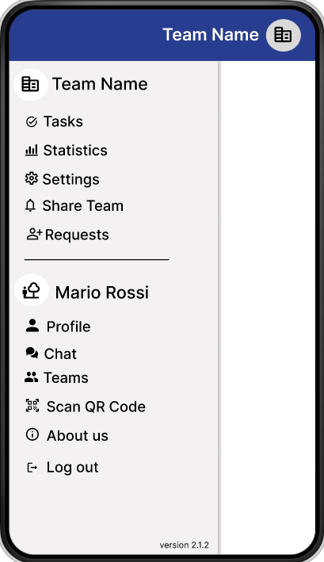
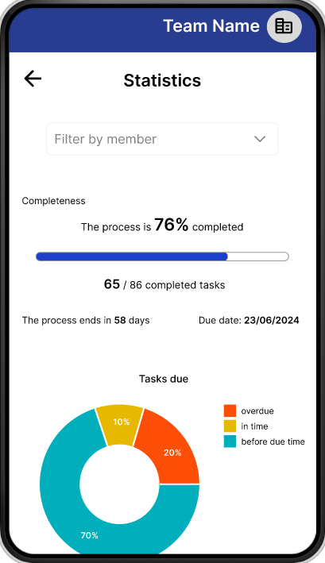

# Google Account Credentials
- Username: `synchrotask@gmail.com`
- Password: `WE^PbVa2bG`

# SynchroTask: A teamwork management application

The last lab focused on connecting the entire app to the Cloud Firestore database, performing remote operations, and implementing user authentication.

The app is designed to enhance collaboration, communication, and coordination among team members, ultimately boosting their productivity and efficiency. With this app, users can manage their participation in multiple teams, access and update task information, document their progress and achievements, report their contributions, and gather feedback from other team members. Additionally, users can access analytic information derived from the collected data. The aim is to streamline communication, improve collaboration, and elevate overall team performance by offering an intuitive app that tracks all aspects of team activities.

To ensure an optimal user experience, the team has adopted a methodical approach to designing the display and editing pages, making extensive use of the Figma graphic tool. The designed pages include:

- *User Authentication Page*: This is a sign-in pane that allows unauthenticated users to start using the application by using the Credential Manager or the Sign in with Google button, which leads to a sign-in process that follows the industry-standard OAuth protocol for authorization.

- *Teams List Page*: This page provides a clear and organized overview of all teams associated with the user. It allows users to quickly identify and manage ongoing team activities, thanks to an intuitive and accessible layout.

- *Team and Private Chat List Page*: This feature enables team members to communicate efficiently within the team and privately, fostering better collaboration and information sharing.

- *SideMenu*: This menu displays essential information about the logged-in user, such as their name, surname, and profile picture, and enables easy navigation to various sections. Users can access their profile page, teams list, chats list, scan QR code, and the about us page. When the user clicks on a specific team, the SideMenu will also display essential information about that team, allowing them to easily navigate to the tasks page, statistics, settings, invitation members page, and requests page for that team. Thus, users can seamlessly transition from viewing the list of teams to accessing a specific team, viewing its details, checking the task list, accessing the chat, viewing member profiles, and reviewing achievements at any moment.

- *Profile Page*: This page provides the logged-in user the ability to view and edit their profile with their information.

- *Scan QR Code Page*: This page shows a link or a QR code that can be scanned with another device to request to join the team.

- *About Us Page*: A page that displays the application's logo and version.

- *Team settings page*: This page allows all team members to view team details, and authorized users to edit them.

- *Invitation Page*: This section allows users to confirm membership in a new team. It can only be possible to view this page after scanning the QR code or using the team link.

- *Team Requests Page*: This page displays all requests from new potential members seeking access to the specific team. Only privileged users, those with the executive leader role, can accept them.

- *Statistics Page*: This section provides performance metrics and analytics for individual team members. It offers visual representations of team achievements, allowing team members to monitor contributions and accomplishments effectively.

### Teams List Page Design and New Team Page Design

    
    

### Team and Private Chat List Page Design

 
 

### Sidemenu Design

### Team settings Page Design

### Share QR Code and Invitation Page Design

### Team Requests Page Design

### Feedback and Performance Page Design

### View Profile Information Screen Design

    
    
    

### Edit Profile Design

    
    

## Some details

**User Authentication Page**

This page facilitates user authentication and access to the application through Google sign-in. Upon verification against Firebase records, users are directed to the home page (team list page). If the entered email is already present in Firebase, a registration form prompts the entry of details such as name, surname, nickname, date of birth, gender, and address to configure personal information. Subsequently, access to the home page is granted.

**Teams List Page:**

This is the homepage of the application, where the logged-in user can view a list of their teams, displaying essential information such as the team name, profile picture, and category. Each team also features two icon buttons enabling the user to edit or delete the team. Clicking on a team allows the user to access the associated tasks list for that team.

At the top of the page, the user can find a search bar for filtering the teams list by name, along with a button that expands the filter options. The filter allows the user to select teams based on category. At the bottom of the page, there is a Floating Action Button (FAB) for streamlined creation of a new team, and a bottom bar which includes two buttons, _Chat_ and _Teams_, to easily switch between pages.

**Team and Private Chat List**

This page shows the chat list of the logged-in user. They have the ability to send direct messages to other team members or to the entire team. The chat displays messages, including the date and time they were sent, as well as the sender's identity. At the top, there is a search bar to easily find a team or private chat, and at the bottom, there is a button that allows starting a new chat. In a specific chat page, by clicking on the name of the chat, it is also possible to navigate to the team page or the profile page of the person.

**Team Settings Page**

This page allows team members to view detailed information about their team, edit their time participation, or leave the team. Additionally, users with the appropriate privileges (Executive Leader Role) have the opportunity to make quick and precise changes to team details, such as the team profile picture, name, description, category, remove members, or edit their roles. Executive Leaders also have the opportunity to invite new members to the team through a link or by scanning a QR code, and to delete the entire team.

**Team Request Page**

This page displays all requests from new potential members seeking access to the specific team. Clicking on a _Preview_ button allows users to access the preview of a specific request, leading to a new page that includes the person's name, surname, profile picture, and email (if not set as private) of the new potential member. Here, only privileged users, those with the executive leader role, can choose to accept or decline the request based on this information.

**Feedback and Performance Page** 

This section provides a visual representation of team achievements, facilitating the understanding and analysis of performance data. Team members can view both individual and collective contributions through a filter bar. This transparency fosters a sense of accountability and motivation within the team. The page displays the completeness of the team process, specifically showing the total number of tasks completed by the entire team or each team member within the due date. It also features a list of top performers, highlighting the member who completed the most tasks in the previous month, thereby recognizing outstanding performance and encouraging healthy competition. Additionally, there are two charts: a donut chart and a bar chart. The donut chart represents the percentage of assigned tasks completed on time, overdue, or before the due time. The bar chart measures the average time in hours taken by the entire team or each team member to complete tasks categorized, offering insight into their efficiency and time management skills.

**Profile Information Screen**

##### - View Profile

In the View Profile Information Screen, various pieces of information are presented, some of which may be visible or hidden based on the user's personalized settings. The information includes:

- A section for personal information such as name, surname, address, biography, nickname, date of birth, gender, phone number, email, and profile picture.
- A section dedicated to team statistics.
- A skills section displaying the user's technical skills and language proficiency.
- A section for anonymous comments left by other application users, providing a form of "review" based on personal experiences. These comments are anonymous, and the user who wrote them cannot be identified.

Additionally, users can view the status of other users, indicating whether they are online or offline within the application. This status is determined based on the user's login status at that moment.

The team statistics section provides information about the number of teams the user is a member of, along with a personal rating for each team. It includes the team's photo, the number of tasks completed compared to those assigned, and an overall rating for the user within that specific team.

The skills section displays the user's soft skills and language proficiency, expressing a level ranging from beginner to expert (from level A1 to level C2) to provide detailed information.

Some information is always visible, such as name, surname, address, biography, and nickname, while others, such as date of birth, gender, phone number, and email, can be hidden at the user's discretion.

##### -  Edit Profile

In the Edit Profile Screen, users have the ability to modify all information except for certain fields considered non-modifiable, such as gender, nickname, and date of birth. This screen also includes a new section for the account, where users can change their email and password. Regarding the password, users are required to enter their current password and confirm the new password to prevent typing errors.

An important feature is the ability to edit the profile picture. A dropdown menu allows users to take a new photo, choose a photo from the gallery, or remove the current photo. If the profile picture is removed or absent, the initials of the name and surname will be displayed as the profile picture.

Fields are velidated before saving the changes. 
- Phone number: must be a valid phone number, consisting of 8-20 digits to accept international numbers also.
- Email: must be a valid email address. It should contain an "@" symbol and a domain name.
- Password: must be at least 8 characters long and contain at least one uppercase letter, one lowercase letter, one number, and one special character.

Here, users can modify the visibility of fields on the View Profile Information Screen through the appropriate switches.

Finally, both pages feature two modes: landscape and portrait, where each screen adopts a responsive layout for any screen size and orientation.

**Sound and Vibration Feedback** 

In the application, sounds and vibrations have been incorporated to provide feedback for various actions. Now, when users perform actions like saving a new team, saving changes to a team, or deleting a task, they'll receive auditory and haptic cues, enhancing their interaction with the app.

### GIF

| Details                  | Images                                  | Details                  | Images                                  |
|--------------------------|-----------------------------------------|--------------------------|-----------------------------------------|
| **Login**                |                  | **Register**             |            |
| **Homepage**             |            | **Edit Team**            |          |
| **Sidemenu**             |            | **Sidemenu Team**        |  |
| **Filter**               |          | **New Team**             |            |
| **Leave and Delete Team**  |   | **Private Chat**   |   |
| **Team Chat**            |          | **Team Requests**        |   |
| **Team Requests**      |  | **Statistics**  |   |
| **View Profile**       |  

### Some Details of profile

| Details                  | Images                                  | Details                  | Images                                  |
|--------------------------|-----------------------------------------|--------------------------|-----------------------------------------|
| **Switch**               |                | **Take a Photo**         |      |
| **Delete a Photo**       |  | **Select a Photo**       |  |
| **Skills and Languages** |  | | |

### Landscape Mode

| Detail                   | Image                                   | Detail                   | Image                                   |
|--------------------------|-----------------------------------------|--------------------------|-----------------------------------------|
| **View**                 |          | **Edit**                 |          |
